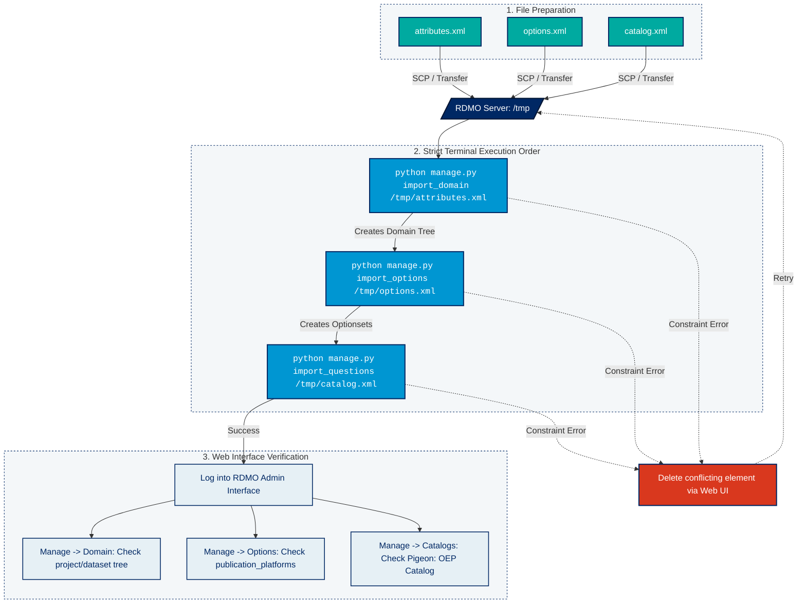

```mermaid  
graph TB
    %% HMC Corporate Color Palette Definitions
    classDef hmcFile fill:#00aaa0,stroke:#002864,stroke-width:2px,color:#fff;
    classDef hmcCmd fill:#0096d2,stroke:#002864,stroke-width:2px,font-family:monospace,color:#fff;
    classDef hmcServer fill:#002864,stroke:#001432,stroke-width:2px,color:#fff;
    classDef hmcWeb fill:#e6f0f5,stroke:#002864,stroke-width:1.5px,color:#002864;
    classDef hmcAlert fill:#d9381e,stroke:#002864,stroke-width:2px,color:#fff;

    %% Neutral Subgraph Styling
    style Prep fill:#f4f7f9,stroke:#002864,stroke-width:1px,stroke-dasharray: 3 3;
    style Execution fill:#f4f7f9,stroke:#002864,stroke-width:1px,stroke-dasharray: 3 3;
    style Verification fill:#f4f7f9,stroke:#002864,stroke-width:1px,stroke-dasharray: 3 3;

    %% 1. FIRST TOP ZONE
    subgraph Prep [1. File Preparation]
        direction LR
        A[attributes.xml]:::hmcFile
        B[options.xml]:::hmcFile
        C[catalog.xml]:::hmcFile
    end

    %% 2. MID INTERMEDIATE ZONE
    Server[/RDMO Server: /tmp/]:::hmcServer

    %% 3. EXECUTION ZONE
    subgraph Execution [2. Strict Terminal Execution Order]
        direction TB
        Step1[python manage.py import_domain /tmp/attributes.xml]:::hmcCmd
        Step2[python manage.py import_options /tmp/options.xml]:::hmcCmd
        Step3[python manage.py import_questions /tmp/catalog.xml]:::hmcCmd
    end

    %% 4. BOTTOM VERIFICATION ZONE
    subgraph Verification [3. Web Interface Verification]
        direction TB
        Web[Log into RDMO Admin Interface]:::hmcWeb
        V1[Manage -> Domain: Check project/dataset tree]:::hmcWeb
        V2[Manage -> Options: Check publication_platforms]:::hmcWeb
        V3[Manage -> Catalogs: Check Pigeon: OEP Catalog]:::hmcWeb
    end

    %% Explicit sequential linking to anchor layout top-to-bottom
    A -->|SCP / Transfer| Server
    B -->|SCP / Transfer| Server
    C -->|SCP / Transfer| Server
    
    Server --> Step1
    
    Step1 -->|Creates Domain Tree| Step2
    Step2 -->|Creates Optionsets| Step3
    
    Step3 -->|Success| Web
    
    Web --> V1
    Web --> V2
    Web --> V3

    %% Side-routed Error Handling path
    Err[Delete conflicting element via Web UI]:::hmcAlert
    Step1 -.->|Constraint Error| Err
    Step2 -.->|Constraint Error| Err
    Step3 -.->|Constraint Error| Err
    Err -.->|Retry| Server
```
